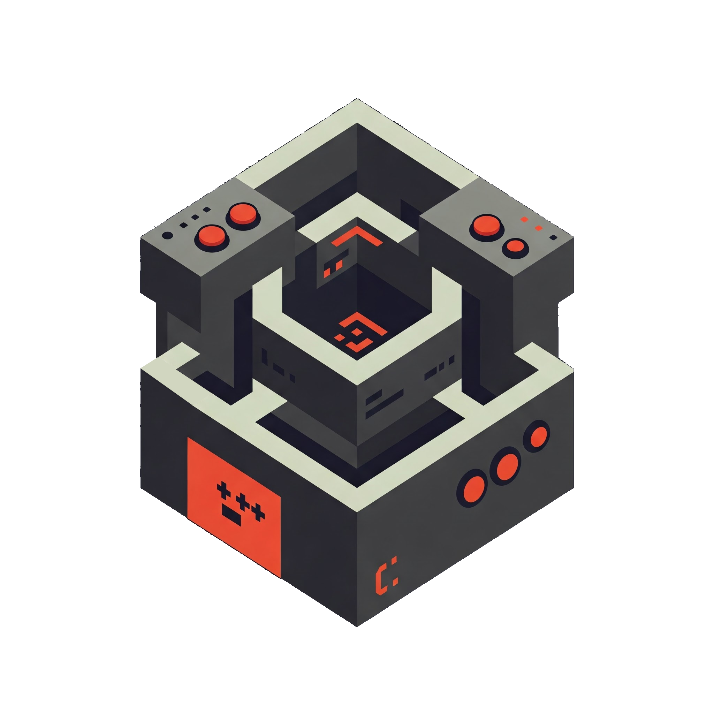

<div align="center">
  <!--suppress CheckImageSize -->
  
  <h1>Game Engine Template</h1>
  <p>
    Multi-branch template for classic game engine architecture.
  </p>
  <p>
    <a href="https://github.com/Meleagrista/cpp-game-engine/graphs/contributors">
      
    </a>
    <a href="">
      
    </a>
    <a href="https://github.com/Meleagrista/cpp-game-engine/stargazers">
      
    </a>
    <a href="https://github.com/Meleagrista/cpp-game-engine/network/members">
      
    </a>
    <a href="https://github.com/Meleagrista/cpp-game-engine/issues/">
      
    </a>
    <a href="https://github.com/Meleagrista/cpp-game-engine/blob/main/LICENSE.txt">
      
    </a>
  </p>

  <h4>
    <a href="https://github.com/Meleagrista/cpp-game-engine/blob/wolfenstein-3d/WALLOFSHAME.md">Wall of Shame</a>
  </h4>

</div>

# Table of Contents
- [About the Project](#about-the-project)
   - [Build With](#build-with)
- [Getting Started](#getting-started)
   - [Prerequisites](#prerequisites)
- [Contributing](#contributing)
   - [Contributors](#contributors)
- [License](#license)
- [Contact](#contact)
- [Acknowledgements](#acknowledgements)

# About the Project
The project is organized as a single repository with multiple branches, each focused on recreating the architecture and rendering techniques of classic game engines like DOOM, Wolfenstein 3D, and others. Its primary goal is to serve as a streamlined starting point for future development based on similar frameworks, acting as a reusable template for related projects.

## Build With
[![C++][cpp-badge]][cpp-url]

# Getting Started
Follow these steps to set up and run the project locally.

## Prerequisites
Before running this project, ensure you have the following tools installed:

### FreeGLUT
This project relies on **FreeGLUT**, a library for managing OpenGL windows and input.

#### On Windows:
The installation process depends on whether you're using **Visual Studio** or **MinGW**. 

> [!IMPORTANT]
> **MinGW** is required for Windows users who are not using Visual Studio. For detailed setup instructions, refer to this [YouTube tutorial](https://www.youtube.com/watch?v=AUFZnA3lW_Q&list=PLmXuiVQyhgd9ZwaF5aWwZblLx9wTBJDAE&index=5).

Follow these steps to install **FreeGLUT** with **MinGW**:

1. **Install MinGW** (if not already installed):
   - Download and install MinGW from [MinGW on SourceForge](https://sourceforge.net/projects/mingw/).

2. **Download FreeGLUT**:
   - Visit the official website: [FreeGLUT Downloads](https://freeglut.sourceforge.net).
   - Download the precompiled package for Windows.

3. **Install FreeGLUT**:
   - Extract the downloaded package.
   - Copy:
     - Header files to `MinGW/include/GL/`
     - Libraries (`.a` files) to `MinGW/lib/`
     - DLLs (if available) to your executable directory or `C:\Windows\System32` (optional but may be necessary for runtime)

#### On Linux:
You can install **FreeGLUT** via your distribution's package manager:

- **On Ubuntu / Debian**:
  ```bash
  sudo apt update
  sudo apt install freeglut3-dev
  ```

- **On Fedora**:
  ```bash
  sudo dnf install freeglut-devel
  ```

- **On Arch Linux**:
  ```bash
  sudo pacman -S freeglut
  ```

This will install both the FreeGLUT development libraries and required dependencies.

### CMake
**CMake** is required to build the project.

- **On Linux**:
  ```bash
  sudo apt update
  sudo apt install cmake
  ```

- **On Windows**:
  Download and install **CMake** from [CMake Downloads](https://cmake.org/download/).

# Contributing
If you have a suggestion that would make this better, please fork the repo and create a pull request. You can also simply open an issue with the tag "enhancement".
Any contributions you make are **greatly appreciated**.

1. Fork the project
2. Create your feature branch.
  ```bash
  git checkout -b feature/AmazingFeature
  ``` 
3. Commit your changes.
  ```bash
  git commit -m 'Add some AmazingFeature'
  ``` 
4. Push to the branch.
  ```bash
  git push origin feature/AmazingFeature
  ``` 
5. Open a pull request

## Contributors
<a href="https://github.com/Meleagrista/cpp-game-engine/graphs/contributors">
  
</a>

# License
This project is licensed under the **MIT License**. See the [LICENSE.txt](./LICENSE.txt) file for full license details.

# Contact
Feel free to reach out if you have any questions or feedback.

Martín do Río Rico - [mdoriorico@gmail.com](mailto:mdoriorico@gmail.com)

# Acknowledgements
Special thanks to the following projects and resources that inspired or supported this project:

- [Awesome Readme Template](https://github.com/Louis3797/awesome-readme-template) – A great starting point for crafting high-quality README files.
- [Best-README-Template](https://github.com/othneildrew/Best-README-Template) – Another excellent template resource for project documentation.
- [Shields.io](https://shields.io/) – For providing useful badges to enhance the README.
- [Choose an Open Source License](https://choosealicense.com/) - For helping to select the right license for this project.

[cpp-badge]: https://img.shields.io/badge/c%2B%2B-%2300599C?style=for-the-badge&logo=C%2B%2B&logoColor=white
[cpp-url]: https://bloodshed.net